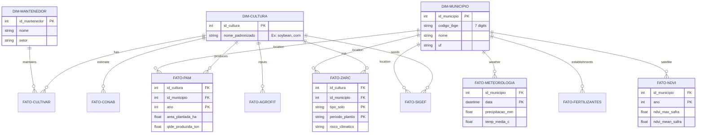
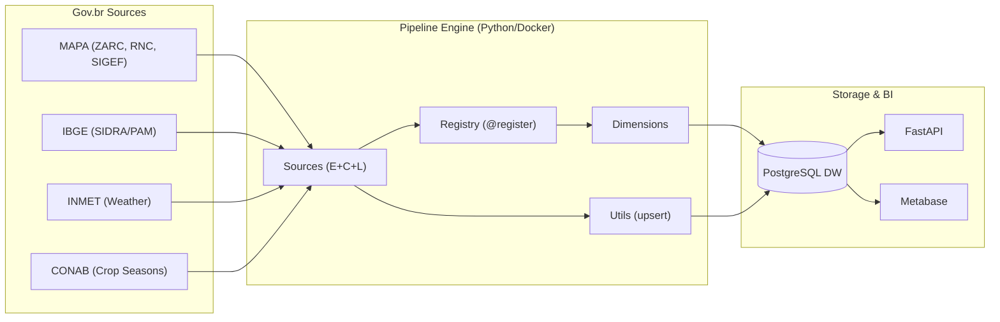

# AgroHarvest BR - Architecture and Modeling

This document details the data structure and information flow of the AgroHarvest BR project.

## 1. Data Model (Star Schema)

The Entity-Relationship Diagram (ERD) below details how dimensions and facts relate in PostgreSQL. This model was designed to optimize analytical queries and reduce data redundancy.



## 2. Data Flow (ETL Pipeline - Registry Pattern)

The pipeline uses the **Registry Pattern**: each data source is a self-contained class (`extract + clean + load`) registered through the `@register` decorator. The orchestrator discovers and runs sources automatically without manual configuration.



### Directory Structure

```
src/
├── main.py                     # Generic orchestrator (~65 lines)
├── db/
│   └── manager.py              # ORM Models (Star Schema)
├── pipeline/
│   ├── registry.py             # @register decorator + discovery
│   ├── base.py                 # BaseSource contract (E+C+L)
│   ├── utils.py                # upsert_data, normalize_string, get_cultura_id
│   ├── dimensions.py           # DimCultura, DimMunicipio, DimMantenedor
│   └── sources/
│       ├── cultivares.py       # SNPC/MAPA
│       ├── sidra.py            # PAM/IBGE
│       ├── zarc.py             # Climate risk (streaming)
│       ├── conab.py            # Production + prices
│       ├── agrofit.py          # Pesticides
│       ├── fertilizantes.py    # SIPEAGRO
│       ├── sigef.py            # Seeds
│       └── inmet.py            # Weather
└── api/                        # FastAPI (analytical endpoints)
```

---
*Diagrams generated for the AgroHarvest BR portfolio.*
